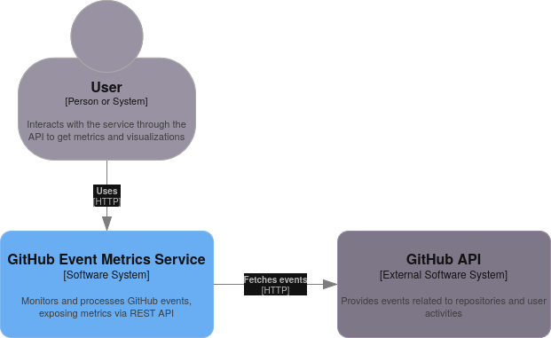

# GitHub Event Metrics Service

This service streams events from the GitHub API and provides metrics through a REST API. The service tracks `WatchEvent`, `PullRequestEvent`, and `IssuesEvent` types. It computes the following metrics:

- **Average Time Between Pull Requests**: For a given repository, the average time between PR creation events.
- **Event Counts**: The total number of events of each type that occurred within a specified time offset (in minutes).
- **Repositories and Pull Request Counts**: A list of all repositories with the count of pull request events for each.
- **Visualization**: A graphical representation (bar chart) of event counts within the given time offset.

## Assumptions
The project is treated as the simplest possible solution to the assignment, NOT a production-ready service, which means:

- The data is stored in memory; no persistence across application restarts.
- There is no cache eviction mechanism, the event store will grow indefinitely.
- The GitHub API rate limits are not explicitly handled (but `X-Poll-Interval` is respected).
- The ETag header is not used to cache API responses.
- The service does not have a graceful exit mechanism.
- No rate limiting for the provided API endpoints.
- No API versioning
- No automatic testing
- A single source file with no directory structure is sufficient.
- Only the [https://api.github.com/events](https://api.github.com/events) endpoint is used, even though a repository-specific endpoint might be more sufficient for computing average pull request time.

If the expectations for the solution were different, let's discuss this in an interview!
My experience with significantly more complicated systems taught me not to overengineer things.

## Architecture



## Requirements:
- Python 3.13 with `pip`
- (Recommended) GitHub Token (set in `GITHUB_TOKEN` environment variable)
- (Optional) `nix` package manager

## Running the Service:
- (Optional) Enter the dev environment via the `nix` package manager
	```
	nix develop
	```

- (Recommended) Create and enter a Python virtual environment
	```
	python -m venv .venv
	source .venv/bin/activate
	```

- (Recommended) Set your GitHub token as an environment variable (otherwise rate limits are reached quite quickly):
	```
	export GITHUB_TOKEN=<your_github_token>
	```

1. Install dependencies:
	```
	pip install -r requirements.txt
	```

2. Start the service:
	```
	uvicorn app:app
	```
	The service will be available at `http://localhost:8000`.

## API Endpoints:

### `GET /metrics/average-pr-time`
- **Description**: Returns the average time (in seconds) between pull requests for a specified repository.
- **Query Parameter**: `repo_name` (str) - The name of the repository.
- **Example Request**:
	```
	GET /metrics/average-pr-time?repo_name=repo-name
	```
- **Example Response (Success)**:
	```json
	{
		"average_seconds": 345.67
	}
	```
- **Example Response (Not Enough PR Events)**:
	```json
	{
		"average_seconds": null, 
		"message": "Only 1 PR event(s) found. At least 2 are required."
	}
	```

### `GET /metrics/event-counts`
- **Description**: Returns the number of events grouped by type for the last `n` minutes.
- **Query Parameter**: `offset_minutes` (int) - The number of minutes to look back (must be greater than 0).
- **Example Request**:
	```
	GET /metrics/event-counts?offset_minutes=10
	```

- **Example Response**:
	```json
	{
		"WatchEvent": 12,
		"PullRequestEvent": 5,
		"IssuesEvent": 7
	}
	```

### `GET /metrics/pr-counts`
- **Description**: Returns a list of repositories and their corresponding pull request event counts.
- **Example Request**:
	```
	GET /metrics/pr-counts
	```

- **Example Response**:
	```json
	{
		"abc/def": 5,
		"ghi/jkl": 3
	}
	```


### `GET /metrics/visualization`
- **Description**: Generates and returns a bar chart visualizing the event counts for the last `n` minutes.
- **Query Parameter**: `offset_minutes` (int) - The number of minutes to look back (defaults to 60, must be greater than 0).
- **Example Request**:
	```
	GET /metrics/visualization?offset_minutes=60
	```

- **Example Response**:
	This endpoint returns an image in PNG format, representing a bar chart of event counts for the specified time offset. The response will have the following content type:
	```
	Content-Type: image/png
	```

	The image will look like a bar chart with event counts for each event type (`WatchEvent`, `PullRequestEvent`, `IssuesEvent`).